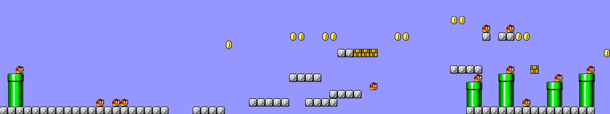

# 레벨 생성기 강화학습

참고한 레포지토리: https://github.com/SUSTechGameAI/MFEDRL

MFEDRL 논문에 따르면, 플레이어가 느끼는 재미에 영향을 주는 요인에는 레벨이 지나치게 낯설거나 익숙하지 않음을 의미하는 레벨 다양성(Level Diversity), 플레이어의 이동 경로가 얼마나 다양한지를 의미하는 게임플레이 다양성(Gameplay Diversity) 등이 있다. MFEDRL 프레임워크를 활용하면 해당 요인을 최적화하는 레벨이 생성되도록, 레벨 생성기의 강화학습을 진행할 수 있다. 또한 강화학습이 완료된 레벨 생성기로 텍스트 파일 형태의 레벨을 생성할 수 있다. 

게임플레이 다양성을 최적화하기 위해 MFEDRL 프레임워크는 `Mario-AI-Framework.jar` 파일로부터 A* 에이전트를 불러와, 생성된 레벨을 테스트한다. 이러한 에이전트 테스트를 포함하여 학습을 진행했을 때, 강화학습의 결과로 **해당 에이전트의 플레이스타일에 최적화된** 레벨 생성기가 만들어진다. 즉 해당 레벨 생성기는 테스트에 사용된 에이전트와 성향이 비슷한 플레이어에게 최적의 재미를 제공할 수 있다.

본 프로젝트는 프레임워크에 포함된 `Mario-AI-Framework.jar` 파일을 수정하여, 플레이스타일 클러스터링 결과로 도출된 7개 에이전트가 담긴 7개의 jar 파일 `Mario-AI-Framework_agent0.jar` ~ `Mario-AI-Framework_agent6.jar` 을 생성하였다. jar파일 번호는 플레이스타일 클러스터링에서 언급된 에이전트 번호와 같다. 해당 jar 파일을 강화학습에 활용하면, 7개 플레이스타일에 최적화된 레벨 생성기를 각각 학습시킬 수 있다. 

### Python 가상환경 구축
Anaconda 가상환경을 생성한 후 다음의 명령어들을 통해 패키지를 설치한다. https://github.com/SUSTechGameAI/MFEDRL 에서 필요한 패키지들을 확인할 수 있다.
```
python -m pip install pip==24.0
pip install “setuptools<60”
pip install JPype1==1.3.0 pygame==2.0.1 dtw==1.4.0 scipy==1.7.2 numpy==1.20.3 pandas==1.3.5 matplotlib==3.4.3
python -m pip install tk
pip install stable-baselines3==1.3.0 --no-deps
pip install torch==1.9.0+cu111 torchvision==0.10.0+cu111 torchaudio==0.9.0 -f https://download.pytorch.org/whl/torch_stable.html
pip download gym==0.21.0
```

### jar 파일 수정 및 재컴파일
`Mario-AI-Framework.jar` 파일의 `agents/robinBaumgarten/AStarTree.java` 파일에 A* 에이전트의 비용 함수가 구현되어 있다. jar 파일을 디컴파일하여 비용 함수의 가중치를  클러스터링 결과에 해당되는 가중치 조합으로 수정한 후 재컴파일했다.

- jar 폴더 압축 해제 명령어
```
jar xf ".jar 파일 경로"
```
- 디렉토리 내의 모든 .java 파일 재컴파일 명령어
```
javac -cp . -d . $(Get-ChildItem -Recurse -Filter *.java | ForEach-Object { $_.FullName })
``` 
- 변경한 jar 파일을 재컴파일한 후 다시 jar 파일로 압축하여 내보낸 후 기존 jar 파일과 교체한다.

- 폴더 내의 모든 파일들을 jar파일로 압축하는 명령어
```
java --create --file Mario-AI-Framework.jar -C ..
```
- 기존 프레임워크의 jar 파일을 새로 만든걸로 카피 명령어
```
Copy-Item -Path "새로 만든 jar 폴더 경로" -Destination "기존 프레임워크 jar 폴더 경로" -Force
```

### 강화학습
학습에 앞서 `MFEDRL\smb.py` 의 `MarioProxy` 클래스에서 학습에 사용할 jar 파일을 지정한다. 
```
class MarioProxy:
    # __jmario = jpype.JClass("MarioProxy")()

    def __init__(self):
        if not jpype.isJVMStarted():
            jpype.startJVM(
                jpype.getDefaultJVMPath() if JVMPath is None else JVMPath,
                f"-Djava.class.path={PRJROOT}Mario-AI-Framework_agent0.jar", '-Xmx2g' # 여기서 jar 파일명 수정
            )
```

다음 명령어로 강화학습을 진행한다. 
```
python train.py designer 
```
명령어 뒤에 추가적으로 변수를 입력하여 학습 설정을 할 수 있다.
| 명령어 | 설명 |
|-------|------|
| --res_path | 레벨 생성기가 저장될 경로를 의미한다. 예를 들어 `agent0` 로 지정하면 `MFEDRL\exp_data\agent0` 폴더가 생성되며 폴더 안에 레벨 생성기가 저장된다. | 
| --n_envs | 동시에 학습되는 환경의 수를 의미한다. 값이 커질수록 학습이 빨라지지만 지나치게 큰 값을 설정하면 학습이 멈출 수 있다. 기본값은 5이다. | 
| --total_steps | 학습을 진행할 스텝 수를 의미한다. 기본값은 100,000이다. | 

그 외의 변수들은 `MFEDRL\src\designer\train_designer.py` 에서 확인할 수 있다.

학습을 진행할 때 `mylog.txt` 파일과 터미널 창에서 일정 스텝 단위로 Funbehaviour, FunContent, Playability 로그를 확인할 수 있다. 해당 로그를 통해 학습이 진행될수록 레벨 다양성, 플레이 다양성, 플레이 가능성 등의 지표가 개선되는 것을 확인할 수 있다.

학습이 완료되면 지정한 경로의 폴더에서 레벨 생성기 모델 `actor.pth`가 생성된 것을 확인할 수 있다.

### 레벨 생성
`MFEDRL\exp_analysis\endless_gen\generate.py` 에서 학습이 완료된 모델로 레벨을 생성한다. 다음 코드에서 설정을 변경할 수 있다. 
```
generate_levels(
        Designer('exp_data/agent0/actor.pth'), # 레벨 생성기 모델이 저장된 경로
        'exp_data/agent0/levels/agent0Levels', # 레벨 파일을 저장할 경로
        100, 50, 10, True                      # 레벨 개수, 각 레벨의 길이, 한 번에 병렬적으로 생성할 레벨의 개수, repair 여부
    )
```

다음 명령어로 레벨을 생성한다.
```
python generate.py
```

레벨 생성이 완료되면 지정한 경로의 폴더에서 레벨 텍스트 파일 `agent0Levels.smblvs` 가 생성된 것을 확인할 수 있다.

### 레벨 플레이하기
`agent0Levels.smblvs`에 저장된 100개 레벨 중 상단의 레벨 하나를 복사하여 `agent0Levels_copy_1_smblvs` 파일을 생성하였다. 

`MFEDRL\smb.py` 에서 생성된 레벨을 직접 플레이해볼 수 있다. 다음 코드에서 레벨 파일의 경로를 지정한다.
```
if __name__ == '__main__':
    # lvl = MarioLevel.from_file('levels/original/mario-1-1.smblv')
    lvl = MarioLevel.from_file('exp_data/agent0/levels/agent0Levels_copy_1.smblvs')
    MarioProxy().play_game(lvl)
    pass
```
다음 명령어로 레벨을 플레이한다.
```
python smb.py
```

### 레벨 이미지 생성
`MFEDRL\convert_to_img.py` 에서 레벨 텍스트 파일이 저장된 경로와 이미지 파일이 생성될 경로를 입력한다.

```
#레벨 불러오기
with open("exp_analysis/endless_gen/data/agent0Levels_copy_1.smblvs", "r") as f:
    content = f.read()
levels = [MarioLevel(c) for c in content.split("\n;\n")]

#첫 번째 레벨을 이미지로 저장
levels[0].to_img('exp_analysis/endless_gen/data/agent0Levels.png')
```

다음 명령어를 실행하면 지정된 경로에 이미지 파일 `agent0Levels.png`가 생성된다.
```
python convert_to_img.py
```


-> agent0Levels.png 일부

### 레벨 성능 평가

**NCD 측정**

**NCD(Normalized Compression Distance)** 는 두 문자열 간 유사도를 측정하는 지표로, 0에 가까울수록 두 문자열 간 유사도가 높고, 1에 가까울수록 유사도가 낮다는 의미이다. 본 프로젝트에서는 강화학습이 완료된 레벨 생성기가 레벨 다양성을 확보하는지 확인하기 위해 NCD를 측정하였다. `MFEDRL\NCD\ncd.py` 는 레벨 텍스트 파일(.smblvs)를 문자열(.txt)로 변환한 후 NCD를 측정한다. 

먼저 `agent0Levels.smblvs`에 저장된 100개 레벨 중 상단의 5개 레벨을 복사하여 `agent0Levels_copy_1_smblvs` ~ `agent0Levels_copy_5_smblvs` 파일을 생성하였다. 다음 명령어를 실행하면 5개 레벨 중 임의로 2개 레벨을 뽑아 측정한 NCD 값을 확인할 수 있다.
```
python ncd.py
```

`ncd.py` 는 적과 아이템(코인, 아이템 블록)의 유무를 기준으로, `ncd2.py` 는 구멍의 유무를 기준으로 문자열을 생성한다.  


**레벨 내 주요 요소 측정**

레벨 생성기 간 생성되는 레벨의 차이점을 분석하기 위해, 레벨 내의 게임 요소(적, 아이템, 구멍 등)의 개수를 측정하는 코드이다. 

`count.py`에 측정을 원하는 레벨 텍스트 파일 경로를 입력한다.
```
#레벨 텍스트 파일 경로
file_path = "exp_data/agent0/levels/agent0Levels.smblvs"
```

다음 명령어를 실행하면 터미널 창에 각 문자의 개수가 출력된다. `count.py` 의 상단 주석에서 각 문자가 어느 게임 요소를 의미하는지 확인할 수 있다. 
```
python count.py
```